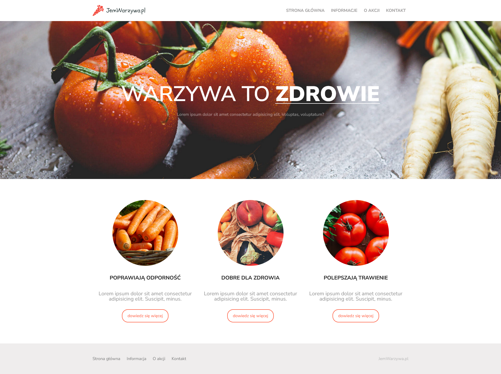

# Jem-warzywa - practical task

"JemWarzywa.pl" is a website project promoting healthy eating and wholesome food. The aim of the website is to inspire people to adopt a healthier lifestyle by advocating for the consumption of vegetables and educating about their health benefits.

**Screenshots:**

## Technologies

The project was created using HTML and CSS technologies. HTML was used to structure the content of the website, while CSS was used for styling and giving it an attractive appearance.

## Project Structure

In the main directory of the project, you will find HTML files containing the web pages and a `css` directory containing CSS files used for styling the website.

## Running the Project

To run the project locally, simply open the HTML files in any web browser.

## Author

The "JemWarzywa.pl" project was designed by CodersLab

